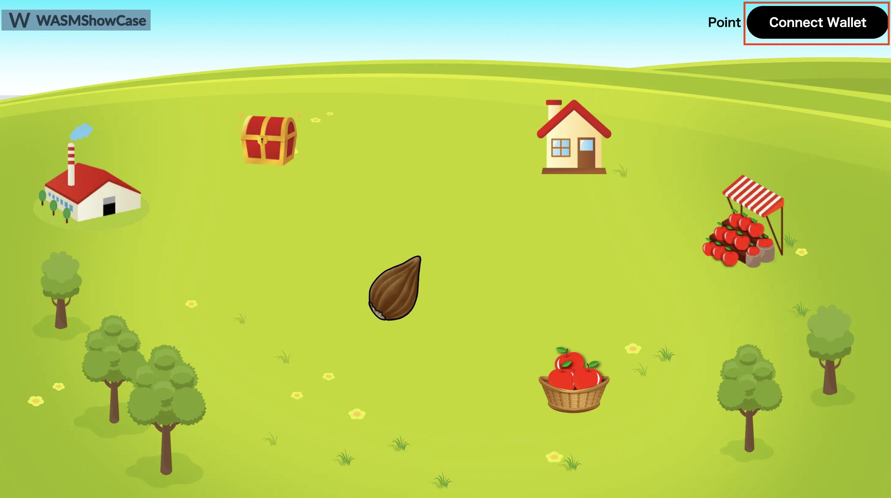
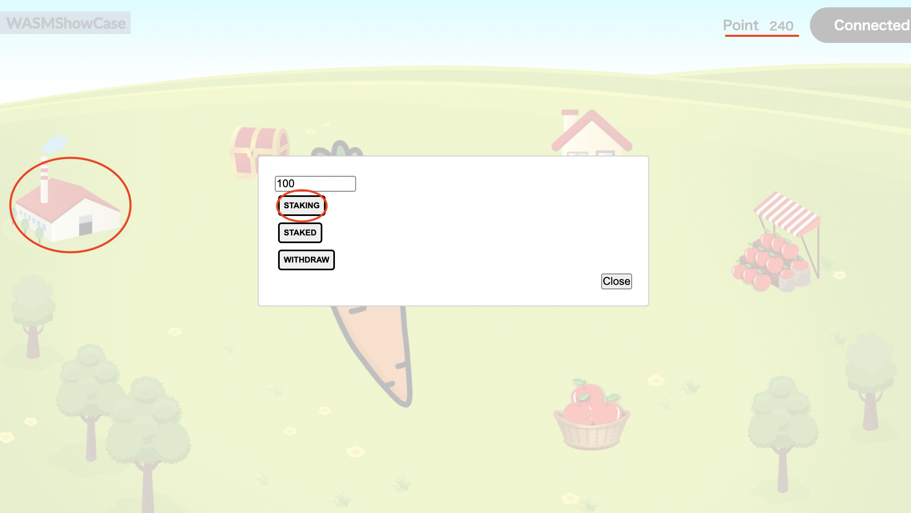

# WasmShowCase

WasmShowCase is a full-on chain of character development games.

By feeding apples, three statuses (Hunger, Health, and Happiness) are randomly changed.
Over time, these statuses will decrease (hunger will increase). Please train with caution.

Their images and names will also change depending on the total amount of staratus. To buy apples, you must use in-game currency.

There are various options for acquiring in-game currency, including purchases, daily bonuses, and staking. Develop your own character.


# Starting the Game

To start the game, you have two options.

1. directly start the game
2. drop the game locally from Github and play.

## Starting the Game Directly

Before starting, please get a Polkadot wallet.

Recommended: use `Talisman` or `Polkadot.js`. 

EVM-based wallets such as MetaMask will not work.

Next, get `Shibuya`, the gas money. If you do not have it, get `Shibuya` from `Faucet`. Once your wallet is ready and you have obtained `Shibuya`, you are ready to go.

First, press the seed button to obtain your own character NFT (`psp34`). Note that only one character NFT can be minted per account.

## To play by dropping locally from Github

Use Github to start up locally as follows.

### Main Contract

First, deploy the `main contract`.

:warning: **Here is the corresponding Github**

First, do a git clone.

```sh
git clone <afterwards>.
```

Then, build the contract.

```sh
cd examples/equippable
cargo contract build
```

Finally, deploy the contract with ``substrate``.
https://contracts-ui.substrate.io/

Use the `rmrk_example_equippable.contract` file in `target > ink > rmrk_example_equippable` for that.

### psp22 contract, psp 37 contract

Next, deploy the `psp22` and `psp37` contracts.

:warning: **Here is the corresponding Github**

First, do a git clone.

```sh
git clone <afterwards>.
```

Then, build the contract.

``psp22``

```sh
cd examples/psp22_extensions/mintable
cargo contract build
```

``psp37``

```sh
cd examples/psp37_extensions/mintable
cargo contract build
```

Finally, deploy the contract with `substrate`.
https://contracts-ui.substrate.io/

`psp22`

Use the `my_psp22_mintable.contractt` file in `psp22_extensions > mintable > target > ink` for that.

`psp37`

Use the `my_psp37_mintable.contract` file located in `psp37_extensions > mintable > target > ink`.

### Front end

Finally, launch the front end.

:warning: **Here is the corresponding Github**

After doing a git clone, run `yarn`.

```sh
git clone <afterwards>
cd astar-showgame-page
yarn
```

For ``index.tsx`` in ``src > pages``, change the contract address to the one you got above.

```js
const mainContractAddress = <Main Contract Address
const psp22ContractAddress = <psp22 Contract Address>
const psp37ContractAddress = <psp37 Contract Address>
````

Sets the address where the proceeds from in-game currency purchases will go.

```js
const ownerAddress = <Wallet Address>
```

Finally, start up with ``yarn dev`` and confirm with ``http://localhost:3000/``.

The rest of the process will follow the `Starting the Game Directly'.

---

## Main building blocks

This contract is implemented with three contracts, PSP34, PSP34Mintable and PSP34Enumerable.

```rust
impl PSP34 for Contract {}

impl PSP34Mintable for Contract {}

impl PSP34Enumerable for Contract {}
```

### 1 Set Status

The Character has three status.
By eating an apple their status change like this function.

```rust
#[ink(message)]
pub fn set_status (
        &mut self,
        token_id: u64, 
        hungry: u32,
        health: u32,
        happy: u32
    ) -> Result<(), PSP34Error>{ 
        self.ensure_exists_and_get_owner(Id::U64(token_id).clone())?;
        self.asset_status.insert(&Id::U64(token_id),&Status {hungry,health,happy});
        Ok(())
    }
```

### 2 Change Status over time

The character's staus is changing over time like this code.
This is example code, so the status change over 60 seconds.

If you want to change the duration, you may change the time.

```rust
#[ink(message)]
pub fn get_current_status(&self, token_id: u64) -> Option<Status> {

    //　get the current time
    let current_time = Self::env().block_timestamp();

    // get the last eaten time
    let last_checked_time = self.last_eaten.get(&Id::U64(token_id)).unwrap_or(Default::default());

    ...
    ...
    ...

        // 60 seconds（60 ※ 1000 miliseconds）
        let past_day = past_time / (60 * 1000) ;
        // Assuming a hypothetical decrease of 5 per unit
        let change_status = past_day * 5;

        let original_status = self.get_status(token_id.clone()).unwrap_or_else(|| {
            // In case the token_id doesn't exist in the asset_status map, we just return a default status with all fields set to 0.
            Status { hungry: 0, health: 0, happy: 0 }
        });

        let new_hungy_status = original_status.hungry + (change_status as u32);
        let new_health_status = original_status.health.saturating_sub(change_status as u32);
        let new_happy_status = original_status.happy.saturating_sub(change_status as u32);

    ...
    ...
    ...

    }
}
```

### 3 Daily Bonus

You can earn game money by using daily bonus.
This is example code, so the status change over 5 minutes.

If you want to change the duration, you may change the time.

```rust
#[ink(message)]
pub fn daily_bonus(&mut self, account_id: AccountId) -> Result<(), ContractError> {

    // Get the time when the last bonus was obtained. In case of error, return 0 
    let last_bonus = self.get_last_bonus(account_id);
    // Function of whether a predetermined amount of time has elapsed.
    let has_passed = self.five_minutes_has_passed(last_bonus);

    //  If the allotted time has not elapsed
    if has_passed ==false {
        Err(ContractError::TimeHasNotPassed.into())
    } else {

        ...
        ...
        ...

    }
}
```

### 4 Claim a NFT

In this game, anyone can mint a NFT only one time.

If you already has an NFT, an erro occurs.

 ```rust
 #[ink(message)]
pub fn claim_a_nft(&mut self) -> Result<(), ContractError> {

    let to = Self::env().caller();

    let token_id = self.current_token_id.checked_add(1).ok_or(ContractError::NumberOverflowError)?;

    let nft_balance = self.balance_of(to.clone());

    if nft_balance > 0 {
        Err(ContractError::AlreadyHadOneNft.into())
    } else {
        self.mint(to,Id::U64(token_id))?;
        self.current_token_id = token_id;
        Ok(())
    }
}
 
```

### 5 Stake Money

You can stake your game money like this function
```rust
#[ink(message)]
pub fn get_your_staked_money(&self, account_id: AccountId) -> u64 {

        ...
        ...
        ...

    } else {
        let past_time = current_time - last_staked_time;
        // 60 seconds（60 ※ 1000 miliseconds）
        let past_day = past_time / (10 * 1000) ;
        // Assuming a hypothetical decrease of 5 per unit
        let change_patio = past_day * 1;
        return staked_money + staked_money * change_patio / 100
    }
}
```

## Interaction between contracts

This main contract(psp34) can interactive with psp22 contract.

You can swap 500 amount of psp22 contract money into 300 amount of game money.
psp22 contract money is transferred to accounts for opperations.

You can change the amount and psp22 contract to original one.
```rust
#[ink(message)]
pub fn buy_game_money(&mut self, target_account_id:AccountId, to: AccountId, data: String) -> Result<(), ContractError>{
    let interface: Psp22ContractRef = ink::env::call::FromAccountId::from_account_id(target_account_id);
    let from = Self::env().caller();
    let money = interface.balance_of(from);
    if money < 500 {
        Err(ContractError::NotEnoughMoney.into())
    } else {
        self.call_psp22_transfer(target_account_id, to, 500, data)?;
        self.plus_your_money(from, 300);
        Ok(())
    }
}
```

## How to play

### 1 Connect wallet

Push the "Connect Wallet" button



If the button changed to "Connected" you can connected your wallet.


### 2 Get your NFT

Push the seed image and prompt you sign the transaction.


After about 10 ~ 30 seconds, this popup occurs.

then push "connected" button.


Then you can see your psp34 character.


### 3 Get your Game Money

Pushing "Point", you can check your game money.

To get game money, push treasure image.


then push "DAILY BONUS" and sign the transaction.

You may wait about 10 ~ 30 seconds


After that, the point changed.


### 4 Buy an apple

Pushing shop image and make transaction, you can buy an apple.


Push the apple image, and you can check your apple number.


### 5 Eat an apple

Push "EATANAPPLE" button and make a transaction.


Push this house image.


Pushing "GET STATUS" button and you can see the status.
This status was determined randomly when eat an apple.


Afeter 5 munites passed, the status chanded.
(hungry was added by 5 and health and happly was substracted by 5)


If the total status(health + happy - hungry) is 200 and more than 200, the image, image and description have changed like this.


This is the image in the main screen.


The total status is 100 and more than 100 and less than 200, the image, name and description have changed, too.


### 6 Stake your game money 

You push a factory icon and this popup occurs.

Enter the amount you want to stake and push "STAKING" button


When you push "staked" button, you can confirm the withdrawal amount. 


This amount is increasing over time.

When you push "WITHDRAW" button, you can withdraw all the amount.


After finising the transaction, game point is increased and staked point become 0.


### 7 Get psp37 nft

You can get psp37 nft per account.
This is memorable item.

After pushing house image, you push "CLAIM" button.


After finishing the transaction, you can confirm your psp37 nft by pushing "GET INFO" button.


## possible actions

### 1 Increasing the variety of items.

You may increase the variety of items.

Now we have only item, apple. 

It's interesting that there are many items and they have different effects. For example, if the character eat "golden apple", their stastus become good absolutely


### 2 Using game point by psp22 

In this game, the game point is not psp22.

If the game point became psp22 token, you can use the currency outside the game.

### 3 using random function after implementing that function to ink! 

In this game , when the character eat an apple , the status changed pseudo-randamly, not randomly.

This is because random function disapperd from ink version 4. So now I made pseudo-randam function that astar network suggested using block timestamp.

So if random function was implemented to ink, modifying random function in this code is preferrable.

