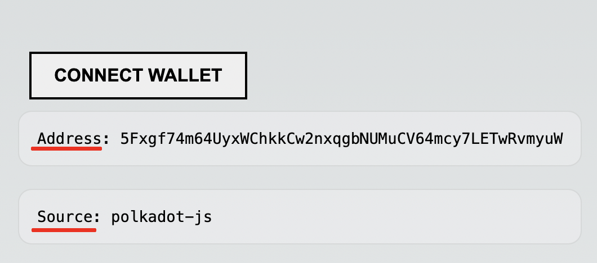
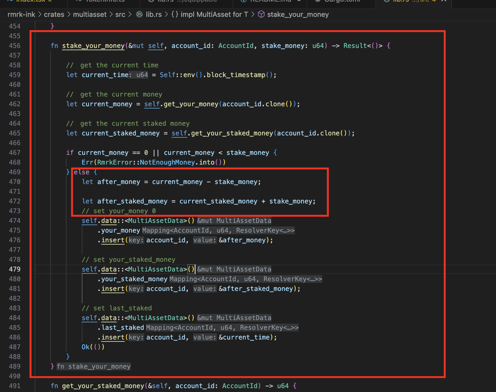
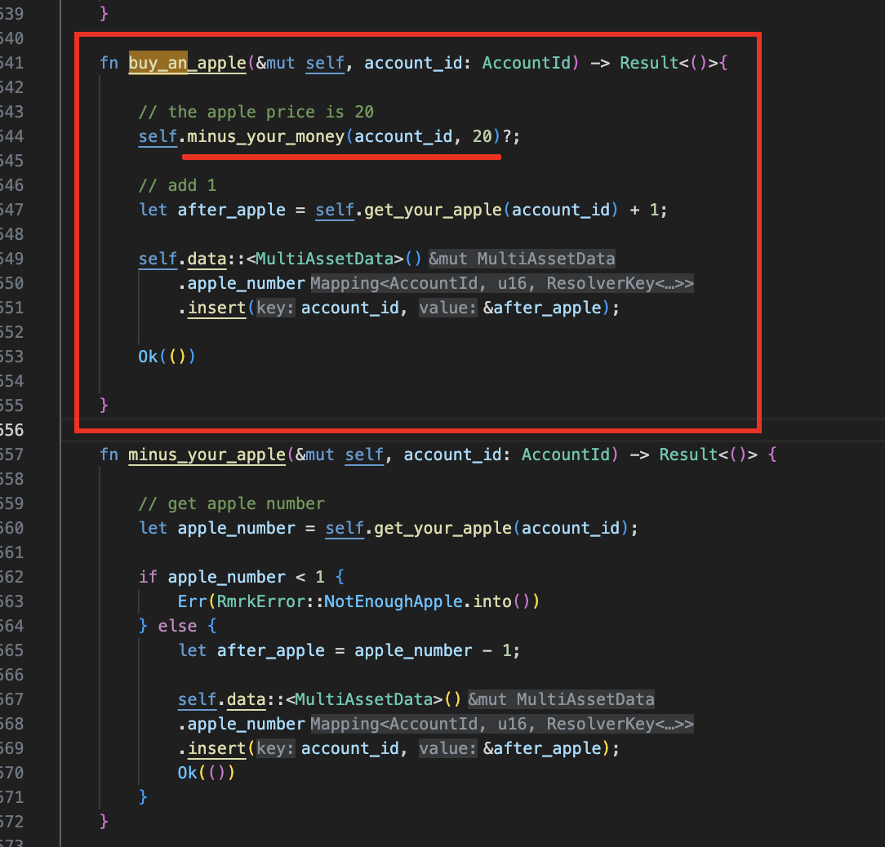
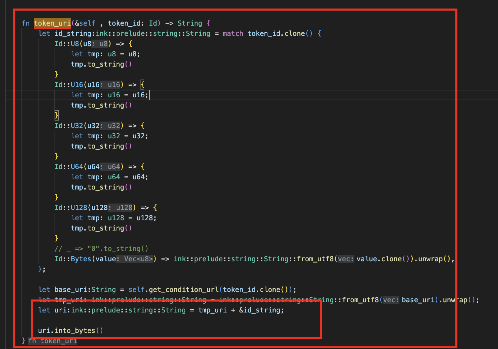
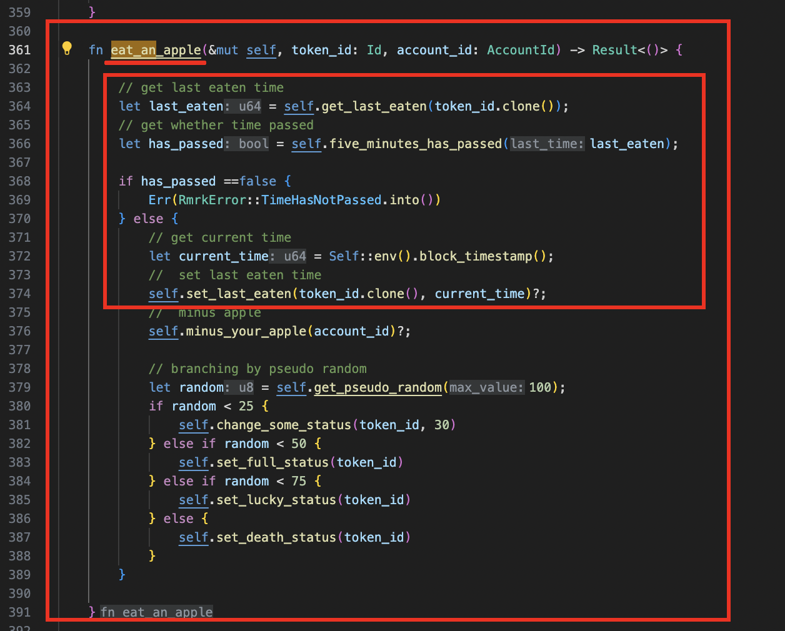
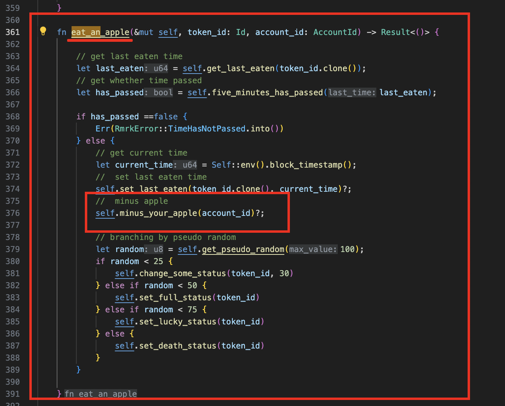
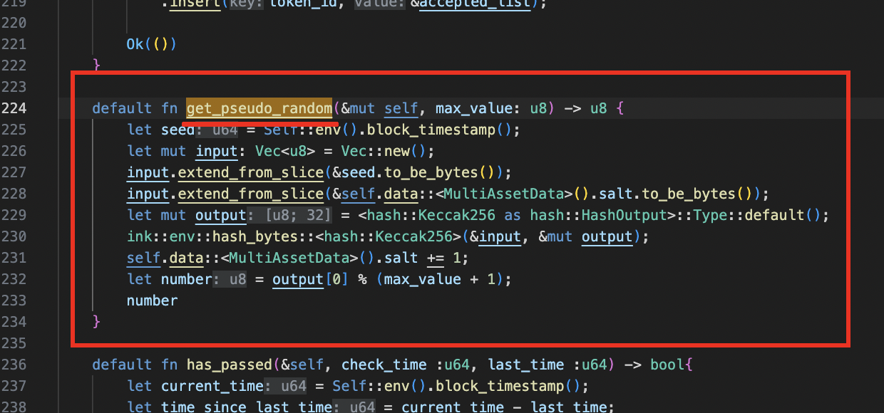
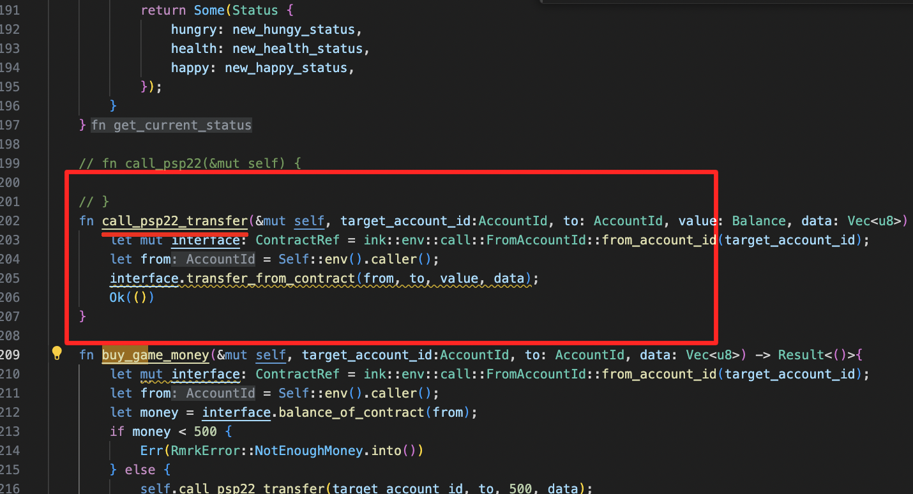
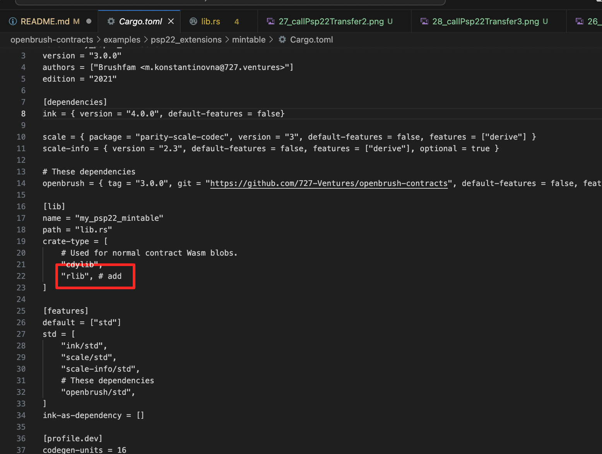

This is a [Next.js](https://nextjs.org/) project bootstrapped with [`create-next-app`](https://github.com/vercel/next.js/tree/canary/packages/create-next-app).

## Getting Started

First, run the development server:

```bash
npm run dev
# or
yarn dev
# or
pnpm dev
```

Open [http://localhost:3000](http://localhost:3000) with your browser to see the result.

You can start editing the page by modifying `pages/index.tsx`. The page auto-updates as you edit the file.

[API routes](https://nextjs.org/docs/api-routes/introduction) can be accessed on [http://localhost:3000/api/hello](http://localhost:3000/api/hello). This endpoint can be edited in `pages/api/hello.ts`.

The `pages/api` directory is mapped to `/api/*`. Files in this directory are treated as [API routes](https://nextjs.org/docs/api-routes/introduction) instead of React pages.

This project uses [`next/font`](https://nextjs.org/docs/basic-features/font-optimization) to automatically optimize and load Inter, a custom Google Font.

## Learn More

To learn more about Next.js, take a look at the following resources:

- [Next.js Documentation](https://nextjs.org/docs) - learn about Next.js features and API.
- [Learn Next.js](https://nextjs.org/learn) - an interactive Next.js tutorial.

You can check out [the Next.js GitHub repository](https://github.com/vercel/next.js/) - your feedback and contributions are welcome!

## Deploy on Vercel

The easiest way to deploy your Next.js app is to use the [Vercel Platform](https://vercel.com/new?utm_medium=default-template&filter=next.js&utm_source=create-next-app&utm_campaign=create-next-app-readme) from the creators of Next.js.

Check out our [Next.js deployment documentation](https://nextjs.org/docs/deployment) for more details.


# 以下、このプロジェクトについての具体的な説明

## 数値についての説明

このdappsにおいては、いくつかの数値を設定しています。
なお、ショーケース用であるため、効果の確認がしやすいよう、すべて短めに設定しています。

### １ Daily Bonus
- 取得ポイント：100
- クールダウン期間：５分

### 2 ステーキング
- 10秒ごとに１％増加

### 3 Buy an Apple
- 20ゲームポイントで１個取得

### 4 Get Status
- 1分ごとにステータスが変更
- hungryは+5, health, happyは-5

### 5 Eat an Apple
- 等確率（確認簡易化のため）で、次のステータスが発生(hungry, health, happyの順で記載)
- 1 通常変化（-30, +30, +30）
- 2 フルステータス (0, 100, 100)
- 3 ラッキーステータス (-50, +50, +50)
- 4 デスステータス (80, 0, 0)

-  クールダウン期間：５分

### 6 Buy Game Money
- psp22を500消費し、ゲームポイントを300取得する

### 7 NFT（psp34, psp37）の取得枚数
- NFTの取得枚数は１枚まで。それ以上取得しようとするとエラーを発生させる。


## URLについての説明

ステータスの変化を起こすURLは下のURLを使用している。

こちらは、Pinataにて作成。
https://www.pinata.cloud/

- normal url

ipfs://Qmce1gmS3s73gASHTbaNnzJNHE7mbbtq5R8pxtkaUWD1KX/

- good url

ipfs://QmUcbBRAhaEMxqf2LCcXGZnVBSoUkfvkNJw3XHVEMRHbSD/

- bad url

ipfs://QmPaBDnTLN972GZda7oQ7EiEe4L6GAHSR2LzLuqd221785/

## 機能についての説明

### １ Connect Walletボタンについて

ウォレット接続を行います。  

Polkadot.js, Talismanなどの対応しています。  

接続を行うと、ウォレットアドレスとソース（どのウォレットで接続しているか）が表示されます。  
(当初はフロントに設定していましたが、console画面に表示させるようにしています。)



### 2 Get Contractボタンについて

コントラクトを取得するためには、下のように、provider, apiからContractPromiseでコントラクトを取得することになります。  


また、コントラクト作成時にできる、jsonファイルを設定することが必要です。  

これがないと、関数の実行などを行うことができません。  


### 3 Daily Bonus機能について

#### １）待機期間の設定について

下のように、待機期間を設定しています。 

設定後、現在時刻をコントラクトに書き込み、次回のDailyBonus実行時の判定に使います。

今回はモデルケースのため、5分で設定しています。


#### 2）ゲーム内通貨の設定について

ゲーム内通貨はコントラクトでMappingとして設定しています。  

今回はべたうちで100としていますが、ここを関数化して、任意の数値を設定できるようにすることで汎用性が増します。


### ４ Get Status機能について

ステータスの取得を行う。  

ステータスは「Hungry」「Happy」「Health」の３つがあり、時間と共に減少していく(Hungryは増える)  

ステータスの減少は前回りんごを食べた時からスタートする。  

まだ１度もりんごを食べたことがない場合は、ステータスは全て初期値の0とする

#### 1）前回りんごを食べた時間を取得

「last_eaten」で前回りんごを食べた時間を取得する。  

食べたことがない場合はステータスを0に設定する  


#### ２）ステータスの減り具合を決定する

現在時刻から「last_eaten」を引き、経過時刻を求める。  

この際、単位はm秒となる。  

今回は図のように、１分単位で、5変化するように設定する。  

また、現在のステータスも取得する。取得できない場合は、0を取得する


#### 3）変化後のステータスを取得する

変化するステータスを元に、変化後のステータスを取得する。  

ここでは、「saturating_sub」関数を使い、0以下になる場合は0を返すようにしている。  


### 5 「Your Apple」, 「Your Money」, 「Staked」 機能について

コントラクトが保持しているデータを取得する。  

データは下のように、Mapping構造になっている。　　


取得できない場合に備え、「unwrap_or_default」関数を使用する。  　　


### ６ Staking機能について

stakeの量が0もしくは金額不足について確認を行う。

該当すればエラー表示


ステーキング後のステーキング量、手持ちのお金の計算を行う。



ステーキング量、手持ちのお金、現在時刻の設定を行う


### 7 Withdraw機能について

ステーキング量を確認し、0の場合はエラーを表示する


エラーでない場合は、引き出し後の合計額を求め、設定を行う


### 8 Buy an Apple機能について

ゲーム内マネー20でリンゴ１つを購入する  

まずは、お金が20以上あるかチェックを行い、なければ、エラーを表示させる。  

問題なければ、変更後のお金で上書きする


次に、リンゴの個数を１つ増やし、上書きする


### 9 Get Info機能について

情報を取得するために、「tokenUri」関数を使用している。

まずは、ID型のtoken_idを取得し、to_string()でString型にする。

その際、matchを用い、型による分岐を行う


次に、get_condition_url関数を用い、urlを取得する

ただし、これがvec型であるため、String型に変換を行う。

これを行わないと、数値との組み合わせができない。


なお、get_condition_url関数は、下のように、conditionによって、返す文字列を変えている


取得したURLとトークンIDを接続し、byteに変換したものを返す



### 10 Eat an Apple機能について

まずは、経過時間を確認し、設定時間が経過していない場合はエラーを返す。

経過している場合は、現在の時刻を設定する。



次に、リンゴの数を減らす。



最後に、擬似乱数を生成し、分岐させる。

なお、確認を行うために、等確率としているものの、一般的にはノーマルのステータス変更：80％、
レアのステータス変更が1％など、確率を変えるものと想定。


また、擬似乱数を求めるコードがこちら



これは、下記のAstarの公式ページから引用している。

https://docs.astar.network/docs/build/builder-guides/xvm_wasm/pseudo_random/

### 11 Buy Game Money機能について

メインコントラクトから、psp22コントラクトの「transfer_from_contract」関数を実行します。



そのために、「Cargo.toml」にて、依存関係を記載します。


一方、lib.rsにて、my_psp22_mintableの使用について記載します。


次は、参照先（ここではpsp22）についてです。

下のようにして、外から使用できるように設定します。


Cargo.tomlにおいても、外からRustで参照できるように、rlibを加えます。



設定が終わると、あとはinterfaceに設定して、呼び出したい関数を実行します。


buy_game_money関数の中で、call_psp22_transfer関数を呼び出しています。


### 12 psp２２,psp３７について

OpenBrushを元に作成している。

https://github.com/Supercolony-net/openbrush-contracts

- psp22

ゲーム内トークンを購入するために使用

https://contracts-ui.substrate.io/contract/WG7GLbCQLnuCyiURRaFsCsmg2E87mwbjoNvT675rxs5tgXe

- psp37 

記念品として使用。１人１NFTまで。

２枚以上取得しようとすると、エラーが発生。

https://contracts-ui.substrate.io/contract/VwRKvqjLhK4NBBwmq3QkLVcdycfqghwe8iMcs95PFQj3A3x